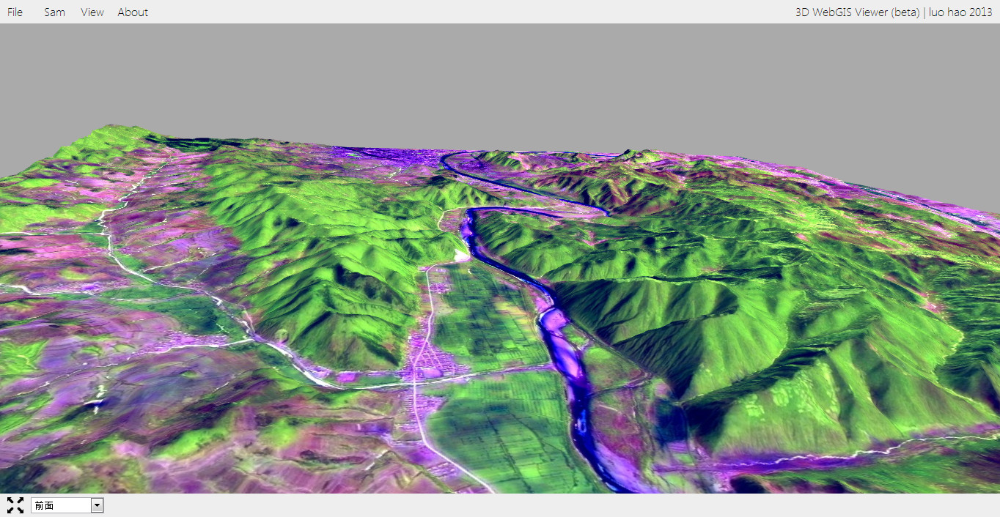
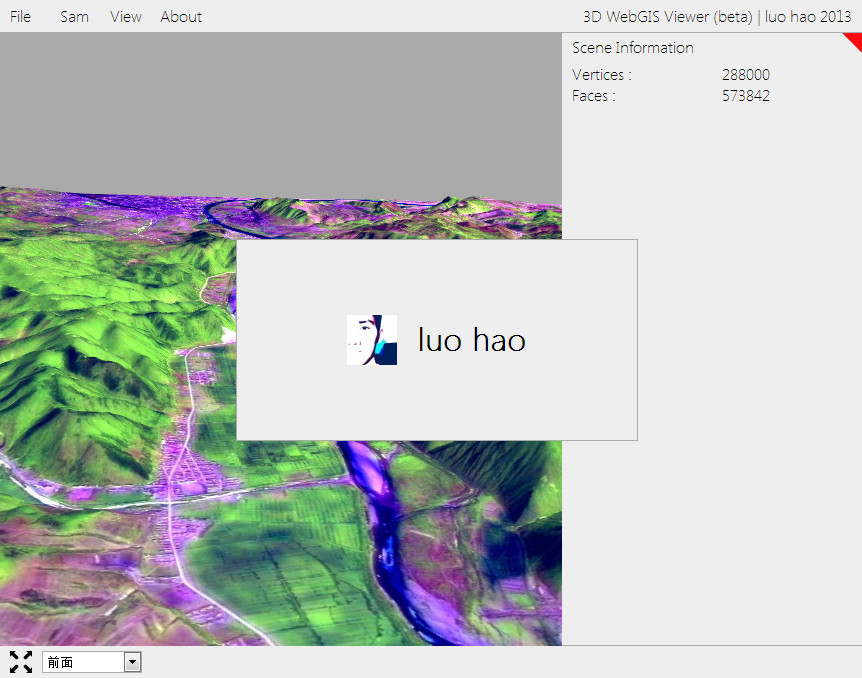

# ThreeJS-WebGIS
An 3D WebGIS App.

	<h3>屏幕截图</h3>
	</img>
	</img>

	<h3>运行</h3>
	<ul>
		<li>
		离线运行。可以直接用支持HTML5、WebGL标准的浏览器打开WebGIS文件夹下的index.html该运行方式支持导入WebGIS文件夹下的model的JSON格式模型，但不能加载纹理。
		</li>
		<li>HTTP环境下运行。你可以把WebGIS放置在你的HTTP服务器目录下访问该目录，也可以通过点击WebGIS文件夹下的http.exe搭建一个http环境，然后在浏览器中访问该目录。该运行方式将会获得该Web应用的所有功能。
		</li>
	</ul>

